# 🧠 NeuroAI – Multi-Agent AI System for Medical Imaging & Virtual Consultation

NeuroAI is an **agent-based medical AI system** designed to assist in **brain MRI analysis** and **virtual patient consultation**. The project combines **computer vision**, **multi-agent orchestration**, **LLMs**, **XAI**, and **RAG** to generate **structured medical reports** in JSON and PDF formats.

The system is divided into **two major parts**:

1. **Brain MRI Image Analysis (Diagnosis + Segmentation + XAI)**
2. **Virtual Medical Consultation & Symptom Analysis**

---

## 🧩 Part 1 – Brain MRI Image Analysis Pipeline

This part processes MRI images (JPEG, PNG, etc.) using **parallel AI agents** coordinated by an **Orchestrator Agent**.

### 🎯 Objectives

* Analyze a new MRI image
* Retrieve similar medical cases
* Perform tumor segmentation
* Explain segmentation results (XAI)
* Generate a final structured medical report (JSON / PDF)

---

## 🔁 Parallel Agents Overview

Two agents operate **in parallel**:

* **Orchestrator Agent** → Diagnosis & similarity-based reasoning
* **Segmentation Agent** → Tumor localization (if present)

Their outputs are later combined and structured by a **final LLM**.

---

## 🧠 Orchestrator Agent – Diagnostic Reasoning

### 🔄 Pipeline Description

1. A **new MRI image** is provided as input
2. The image is encoded using **MedViT**
3. A **768-dimensional embedding vector** is generated
4. Similar images are retrieved using **FAISS**
5. Diagnostics are retrieved or generated using **LLMs**
6. A **final aggregated diagnostic JSON** is produced

---

### 🗺️ Mermaid Diagram – Orchestrator Pipeline

```mermaid
flowchart TD
    A[New MRI Image] --> B[MedViT Embedding]
    B --> C[768D Vector]
    C --> D[FAISS Similarity Search]
    D --> E[Top 5 Similar Images + Indices]
    E --> F[Retrieve Image Paths]

    F --> G{Check MongoDB}
    G -->|Diagnostics Exist| H[Load Stored Diagnostics]
    G -->|Not Found| I[Gemini LLM – Analyze Similar Images]
    I --> J[Save Diagnostics in MongoDB]

    A --> K[Gemini LLM – Analyze New Image]

    H --> L[Aggregation]
    J --> L
    K --> L

    L --> M[Final Diagnostic JSON<br/>6 Diagnostics]

```

---

## 🧩 Segmentation Agent – Tumor Localization

### 🔬 Model

* **U-Net based architecture**
* **ResNet encoder**
* Outputs pixel-level segmentation mask

### 📤 Output

* Tumor location (if detected)
* Segmentation metadata
* JSON output

---

## 🔍 XAI Agent – Explainability

After segmentation, an **XAI Agent** explains the results:

* Interprets segmentation output
* Explains why a region is considered abnormal
* Uses **LLaMA 8B** for medical explainability
* Updates the segmentation JSON with explanations

---

## 🧾 Final Medical Report Generation

* The **Orchestrator JSON**
* The **Segmentation + XAI JSON**

⬇️

Both are passed to **LLaMA 70B**, which:

* Structures a coherent medical report
* Uses clinical language
* Generates:

  * Structured JSON
  * Exportable **PDF medical report**

---

## 🩺 Part 2 – Virtual Medical Consultation System

This part handles **patient interaction and symptom-based reasoning** using a **local agentic LLM system**.

### 🎯 Objectives

* Interact with patients (text, audio, video)
* Extract and normalize symptoms
* Estimate cancer probability
* Generate personalized recommendations

---

## 🎙️ Multi-Modal Patient Input

Supported input formats:

* 📝 Text
* 🎤 Audio (speech)
* 🎥 Real-time video

---

## 🤖 First Layer Agents (Parallel)

1. **Conversation Agent**

   * Interacts naturally with the patient

2. **Symptom Extraction Agent**

   * Extracts symptoms from raw input
   * Outputs structured JSON

---

## 🧠 Agentic Medical Reasoning System

The extracted symptoms JSON is processed by **multiple specialized agents**, all powered by **LLaMA 3.1 (local)**.

### 🗂️ Agent Roles

* **Agent 1 – Data Normalization**

  * Parsing and standardization

* **Agent 2 – Symptom Scoring (RAG)**

  * Assigns importance scores to symptoms
  * Uses medical knowledge retrieval

* **Agent 3 – Risk Estimation**

  * Estimates cancer probability
  * Generates recommendations

* **Agent 4 – Report Generation**

  * Creates a detailed medical report

* **Agent 5 – Database Management**

  * Stores patient data securely

---

### 🗺️ Mermaid Diagram – Virtual Consultation Pipeline

---

## 📦 Final Outputs

For each patient, the system generates:

* ✅ Structured **JSON medical data**
* 📄 **Detailed medical report**
* 📑 Optional **PDF export**

---

## 🚀 Key Technologies

* **Deep Learning**: MedViT, U-Net, ResNet
* **Vector Search**: FAISS
* **Databases**: MongoDB
* **LLMs**:

  * Gemini (image reasoning)
  * LLaMA 8B (XAI)
  * LLaMA 70B (report structuring)
  * LLaMA 3.1 local (agentic system)
* **XAI**: Explainable segmentation
* **RAG**: Symptom scoring & medical reasoning

---

## ⚠️ Disclaimer

This project is intended for **research and educational purposes only** and **does not replace professional medical diagnosis**.

---

## 👩‍💻 Authors

Developed as part of an academic AI project focusing on **Neuro-AI, Multi-Agent Systems, and Medical Decision Support**.
